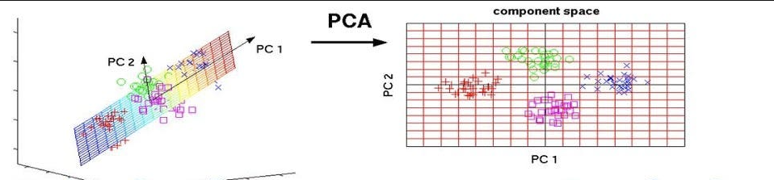

# Principal-Component-Analysis

As the number of features or dimensions in a dataset increases, the amount of data required to obtain a statistically significant result increases exponentially. This can lead to issues such as overfitting, increased computation time, and reduced accuracy of machine learning models this is known as the curse of dimensionality problems that arise while working with high-dimensional data.

As the number of dimensions increases, the number of possible combinations of features increases exponentially, which makes it computationally difficult to obtain a representative sample of the data and it becomes expensive to perform tasks such as clustering or classification because it becomes. 

 **Dimensionality reduction** is a type of feature extraction technique that aims to reduce the number of input features while retaining as much of the original information as possible.

***Principal Component Analysis (PCA)*** is a statistical procedure that uses an orthogonal transformation that converts a set of correlated variables to a set of uncorrelated variables. The main goal of PCA is to reduce the dimensionality of a dataset while preserving the most important patterns or relationships between the variables without any prior knowledge of the target variables. 

**Advantages of Principal Component Analysis:**

- Dimensionality Reduction
- Feature Selection
- Data Visualization
- Multicollinearity
- Noise Reduction
- Data Compression
- Outlier Detection

**Disadvantages of Principal Component Analysis:**

- Interpretation of Principal Compenents
- Data Scaling
- Information Loss
- Non-linear Relationships
- Computational Complexity
- Overfitting



## Dataset

In this notebook wine dataset from UCI used. 

[Wine Data](https://archive.ics.uci.edu/dataset/109/wine)

The attributes are :
1) Alcohol
2) Malic acid
3) Ash
4) Alcalinity of ash  
5) Magnesium
6) Total phenols
7) Flavanoids
8) Nonflavanoid phenols
9) Proanthocyanins
10) Color intensity
11) Hue
12) OD280/OD315 of diluted wines
13) Proline 


## Environment

In order to create the environment for this repo you can  use the [requirements](requirements.txt) file in this repo:

```BASH
pyenv local 3.11.3
python -m venv .venv
source .venv/bin/activate
pip install --upgrade pip
pip install -r requirements.txt